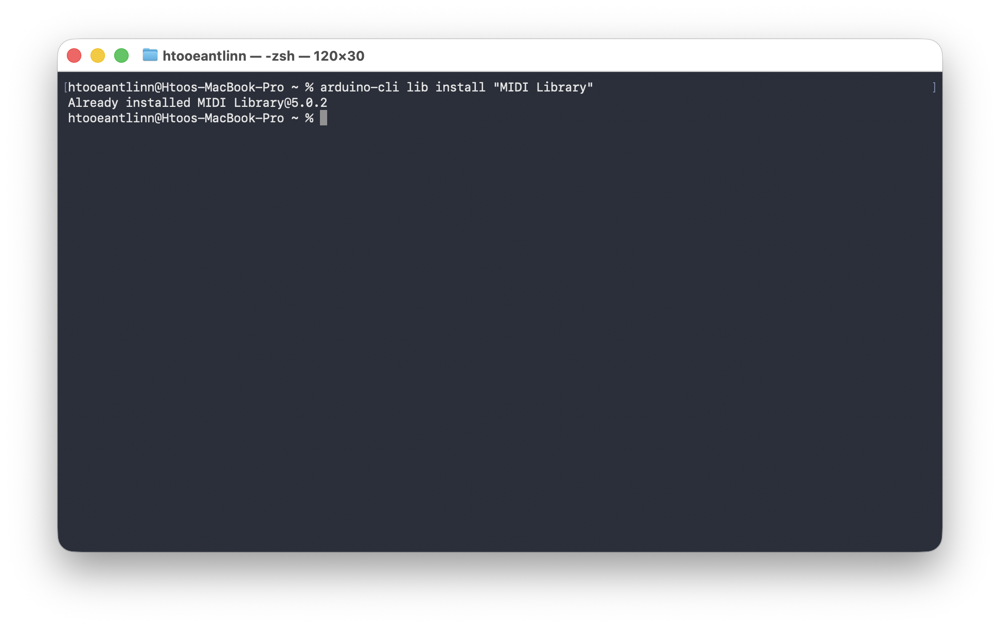
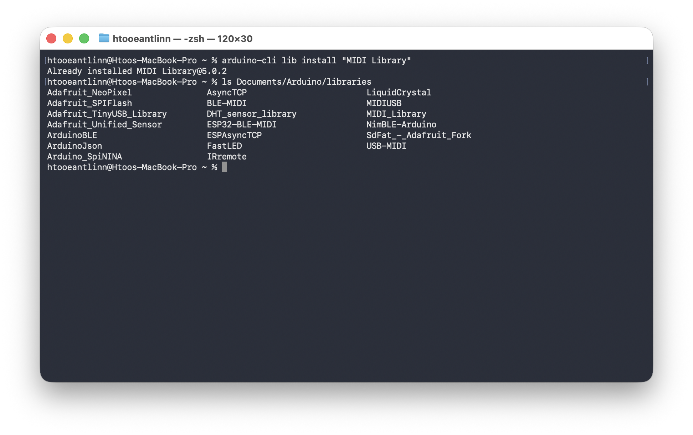
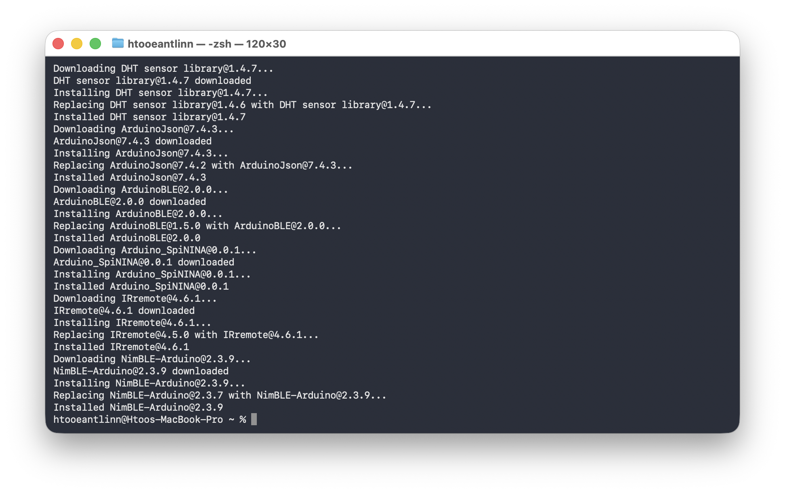
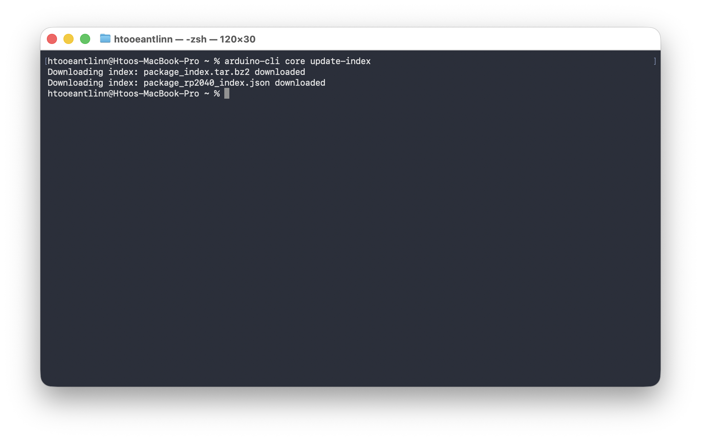
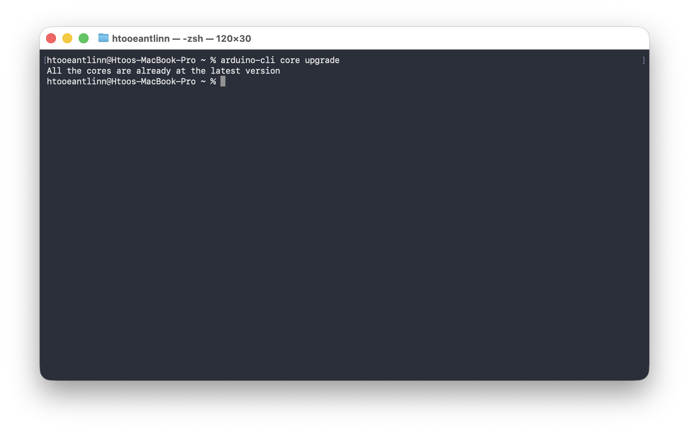
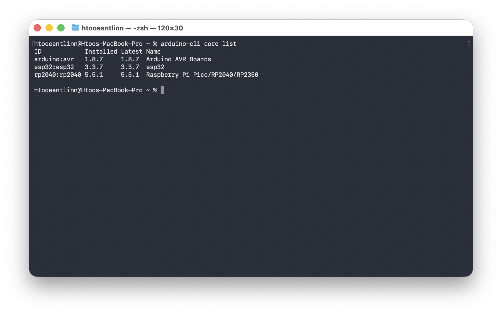
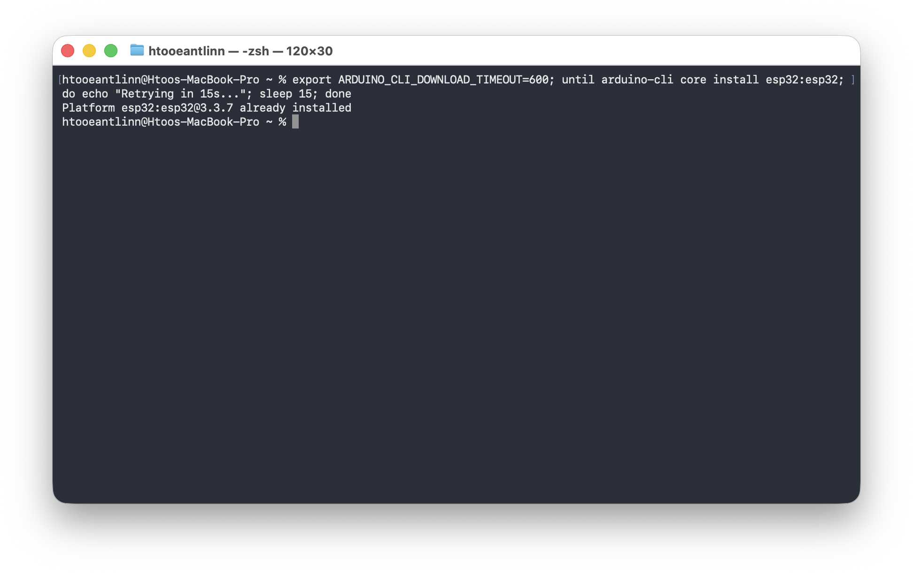
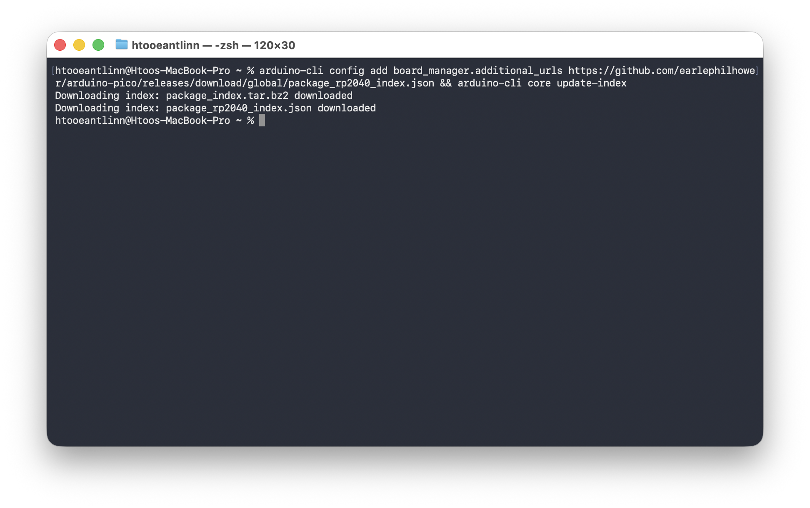
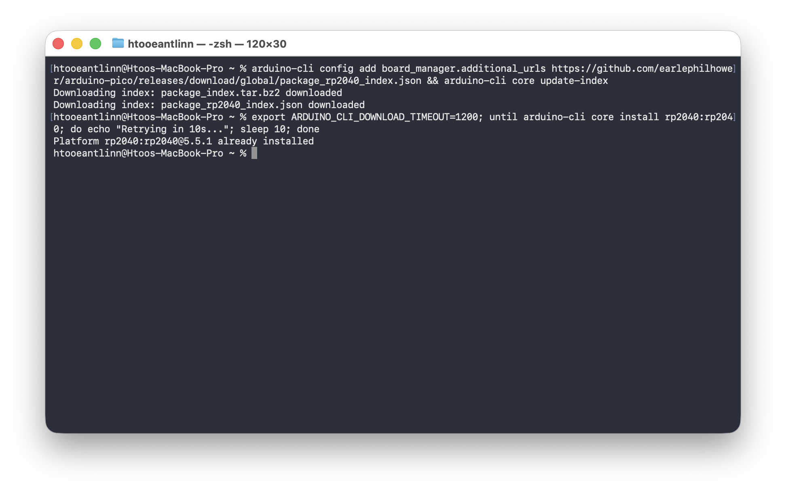
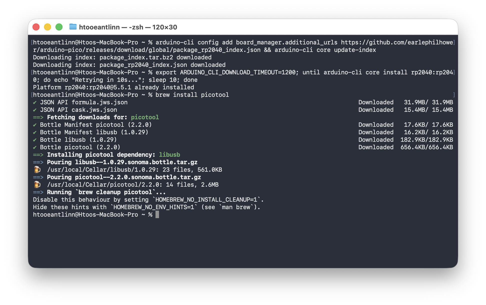

# Library & Core
```bash
arduino-cli install “MIDI Library”
```


We can find our libraries.
```bash
ls /Documents/Arduino/libraries.
```


We can upgrade our libraries version.
```bash
arduino-cli lib upgrade
```


```bash
arduino-cli core update-index
```


```bash
arduino-cli core upgrade
```


Shows the list of installed platforms on our system.
```bash
arduino-cli core list
```


---

## Arduino UNO core install
```bash
arduino-cli core install arduino:avr
```


---

## ESP32 core install
```bash
export ARDUINO_CLI_DOWNLOAD_TIMEOUT=600; until arduino-cli core install esp32:esp32; do echo "Retrying in 15s..."; sleep 15; done
```


---

## Pi Pico 2W core install
```bash
arduino-cli config add board_manager.additional_urls https://github.com/earlephilhower/arduino-pico/releases/download/global/package_rp2040_index.json && arduino-cli core update-index
```

```bash
export ARDUINO_CLI_DOWNLOAD_TIMEOUT=1200; until arduino-cli core install rp2040:rp2040; do echo "Retrying in 10s..."; sleep 10; done
```

```bash
brew install picotool
```
