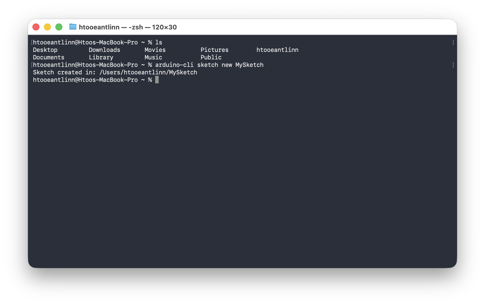
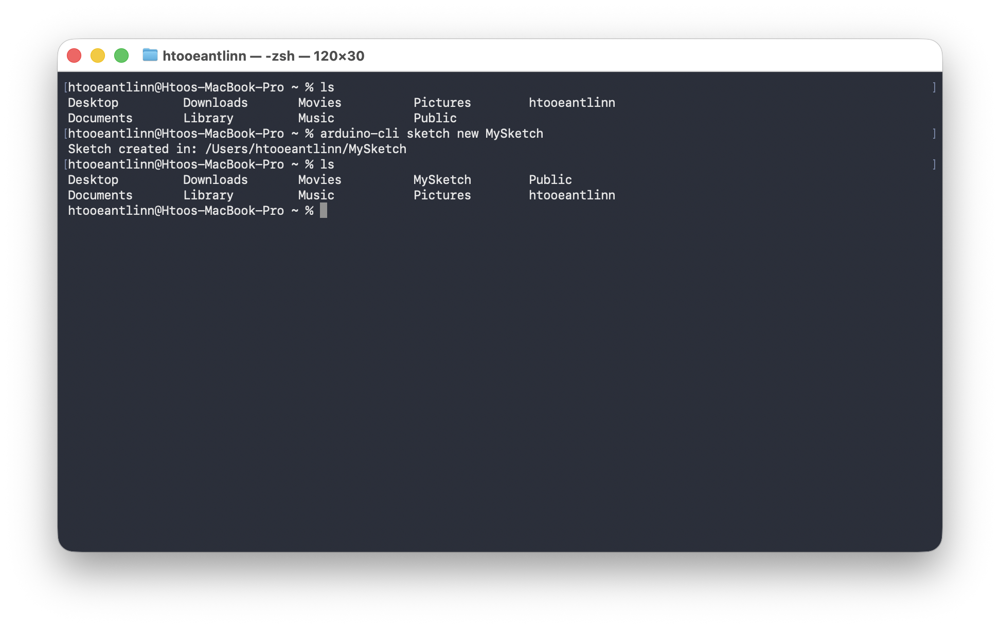
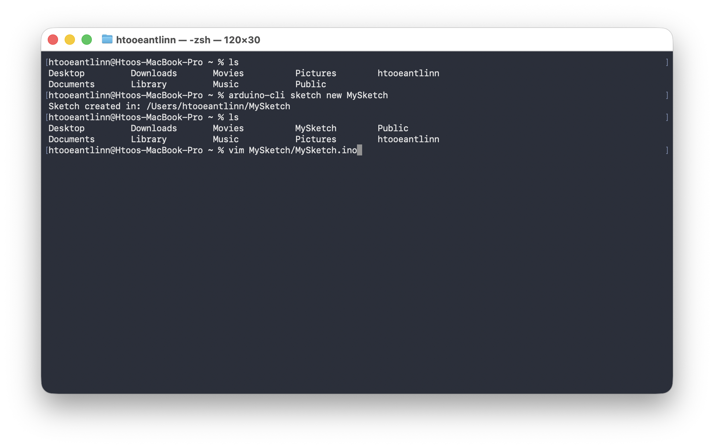
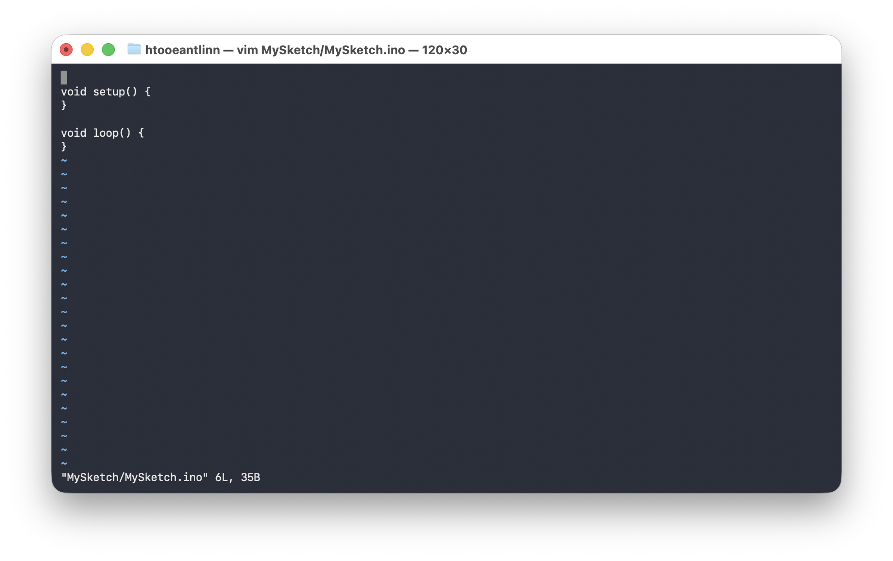
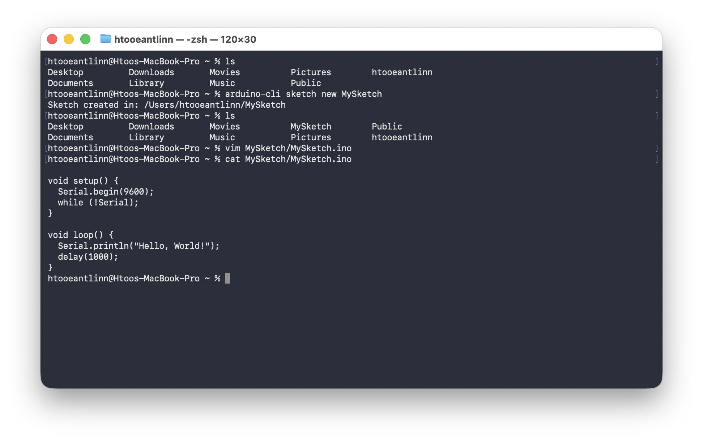

# Sketch to Project
```bash
ls
```


```bash
arduino-cli sketch new MySketch
```


```bash
ls
```


```bash
vim MySketch/MySketch.ino
```


```bash

void setup() {
  Serial.begin(9600);
  while (!Serial);
}

void loop() {
  Serial.println("Hello, World!");
  delay(1000);
}
```



```bash
cat MySketch/MySketch.ino
```


